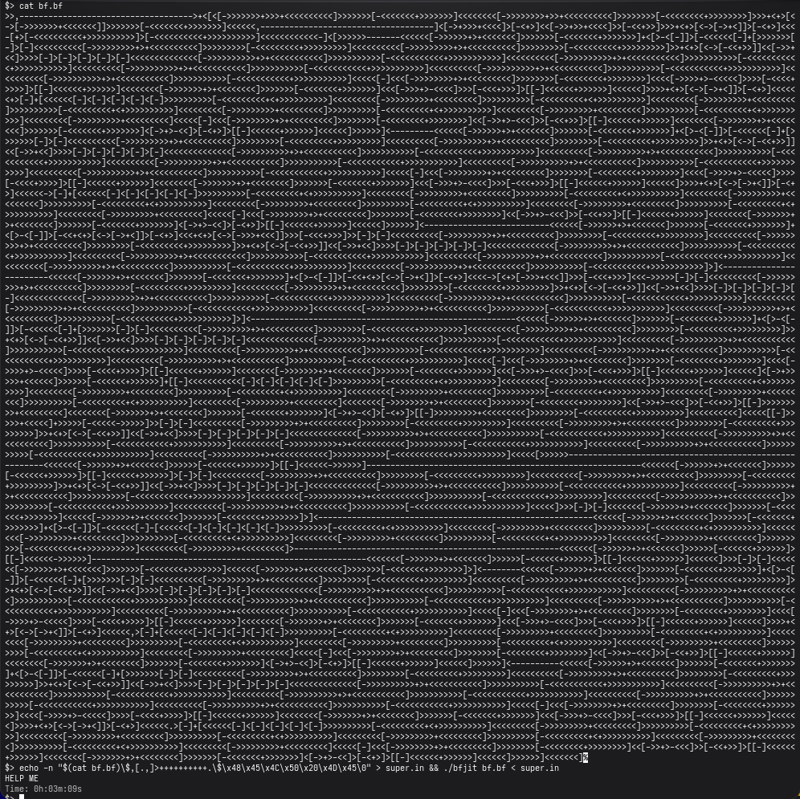

# BrainFuck in BrainFuck
one night I couldn't sleep, and, you know...

## How To Use
final product is `bf.bf` and you can interpret it with any valid interpreter you find, `bfint.py` for example.

input format for `bf.bf` is f"{code}\${input}" (in python fstring). in other words: you provide BrainFuck program in ASCII format (without comments), a \$ character and then input for the provided BrainFuck program.

## Source Code
`bf_human.high_level` is a high level code that explains how this interpreter works. `bf_human.bf` is just `bf` with comments, for avoiding repeatition, contents of `next_page_human.bf` and `prev_page_human.bf` will replace `#next_page` and `#prev_page` in `bf_human.bf`, respectively.

## Performance
it is BrainFuck in BrainFuck, so yes it is a little bit slow, specially if you use python for interpreting it! although I managed to interpret it on itself using a [JIT-compiler](https://github.com/t3tra-dev/bfjit) in a resonable amout of time:

## Security
the interpreter (`bf.bf`) puts the tape data next to the code, so you should be careful with your code! it also uses 2 bytes for addressing, so your BrainFuck program and its input most fit in less than $2^16=65536$ characters.

## Acknowledgements
`bfint.py` was initially stolen from [here](https://github.com/pocmo/Python-Brainfuck).
